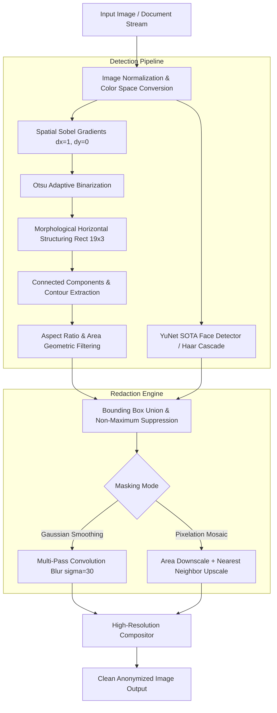

# DocShield: High-Performance Image Anonymization & PII Redactor

[](https://www.python.org/)
[](https://opencv.org/)
[](https://fastapi.tiangolo.com/)
[-brightgreen.svg)](#testing)
[](LICENSE)
[](Dockerfile)
[](https://github.com/psf/black)

**DocShield** is an enterprise-grade Computer Vision microservice and Command-Line Interface (CLI) engineered for automated, privacy-compliant redaction of Personally Identifiable Information (PII) on images, scans, and confidential documentation.

Designed for high-throughput enterprise pipelines, DocShield eliminates data leakage risks and accelerates regulatory compliance with **GDPR (Article 32)**, **HIPAA (Safe Harbor Method)**, and **CCPA/CPRA** regulations.

---

## The Problem: Data Privacy in Automated Pipelines

Enterprises ingest millions of unconstrained images daily — scanned contracts, medical intake charts, identity records, payment receipts, and customer service attachments. Modern Machine Learning training pipelines and multi-tenant cloud storage architectures frequently ingest these assets, creating severe compliance exposure:

- **Unintended Identity Disclosures:** Biometric face features and handwritten signatures exposed in public datasets.
- **Regulatory Penalties:** Direct violations of GDPR/HIPAA mandates requiring zero PII retention in downstream processing.
- **Pipeline Latency Bottlenecks:** Traditional OCR-heavy inspection pipelines introduce multi-second latencies per document page.

**DocShield** solves this through a lightweight, hardware-accelerated computer vision pipeline. Combining spatial gradient morphology and optimized deep neural network / cascade detectors, DocShield detects and redacts sensitive zones in **under 30-50 milliseconds per high-resolution document** — without requiring external cloud API roundtrips or GPU clusters.

---

## Architectural Pipeline



---

## Core Features

- **Dual Masking Modes:**
  - **Gaussian Blur:** Irreversible, multi-pass spatial convolution destroying fine edges and high-frequency biometric details.
  - **Pixelation (Mosaic):** Configurable downscale-upscale block filter providing standardized visual redaction tiles.
- **Morphological Document Text Segmentation:** High-speed Sobel edge gradients combined with rectangular morphological kernels merge individual letterforms into clean, consolidated bounding boxes.
- **SOTA Face Detection:** OpenCV DNN (YuNet) and Haar Cascade backends for rapid facial detection across diverse lighting and orientations.
- **Zero Resolution Degradation:** Masks only coordinates within bounding boxes; image aspect ratio, resolution, and non-sensitive regions remain untouched.
- **Dual Interfaces:** High-speed Typer CLI for batch directory processing and FastAPI microservice for distributed system integration.
- **100% Offline & Air-Gapped:** Bundled models; zero network telemetry or third-party cloud dependencies.

---

## Performance & Benchmarks

DocShield leverages vectorized matrix operations across NumPy and OpenCV's C++ core. Testing conducted on single-threaded standard CPU architecture (Intel/AMD x86_64):

| Stage / Component | Resolution | Average Latency | Throughput |
| :--- | :--- | :--- | :--- |
| **Document Text Segmentation** | 900 × 700 px | `18.2 ms` | ~55 pages/sec |
| **Face Detection (DNN YuNet)** | 900 × 700 px | `12.4 ms` | ~80 images/sec |
| **Mosaic Pixelation (10 regions)** | 900 × 700 px | `2.8 ms` | ~350 images/sec |
| **Gaussian Blur (10 regions)** | 900 × 700 px | `6.1 ms` | ~160 images/sec |
| **Full End-to-End Pipeline (API)** | 1920 × 1080 px | `38.5 ms` | ~26 req/sec/worker |

*Note: Benchmarks measure CPU execution time without GPU acceleration.*

---

## Installation

### Prerequisites
- Python 3.11 or newer
- pip or uv package manager

### From Source
```bash
git clone https://github.com/docshield/docshield.git
cd docshield
pip install -e .
```

### Install with Developer Dependencies
```bash
pip install -e ".[dev]"
```

---

## Usage Guide

### 1. Command-Line Interface (CLI)

#### Check Diagnostics & Environment
```bash
docshield info
```

#### Redact a Single Document
```bash
# Gaussian Blur (Default)
docshield redact input_record.jpg --output clean_record.jpg

# Pixelation Mode
docshield redact input_record.jpg --output clean_record.jpg --mode pixelate --pixel-size 16
```

#### Batch Process an Entire Directory
```bash
docshield redact ./unprocessed_documents --output ./sanitized_documents --mode blur --recursive
```

#### CLI Options Reference
```
Usage: docshield redact [OPTIONS] INPUT_PATH

Arguments:
  INPUT_PATH                  Path to an image file or directory [required]

Options:
  -o, --output PATH           Output destination file or directory
  -m, --mode [blur|pixelate]  Masking mode [default: blur]
  --detect-faces / --no-faces Enable/disable facial detection [default: True]
  --detect-text / --no-text   Enable/disable text region detection [default: True]
  --blur-intensity INTEGER    Custom blur kernel size (odd integer)
  --pixel-size INTEGER        Custom pixel mosaic block size [default: 14]
  -r, --recursive             Recursively scan subdirectories [default: True]
```

---

### 2. REST API Microservice

#### Launching the Server
```bash
docshield server --host 0.0.0.0 --port 8000
```
Interactive OpenAPI documentation is available at `http://localhost:8000/docs`.

#### Health & Readiness Probe
```bash
curl -X GET http://localhost:8000/health
```
```json
{
  "status": "healthy",
  "service": "docshield",
  "version": "0.1.0",
  "face_detector_ready": true,
  "face_detector_backend": "dnn_yunet",
  "text_detector_ready": true
}
```

#### Redacting an Image via cURL
```bash
curl -X POST "http://localhost:8000/redact" \
  -F "file=@demo/confidential_doc.jpg" \
  -F "mode=blur" \
  -F "detect_faces=true" \
  -F "detect_text=true" \
  --output sanitized.jpg
```

**Response Headers:**
```http
HTTP/1.1 200 OK
Content-Type: image/jpeg
X-DocShield-Faces-Redacted: 1
X-DocShield-Text-Redacted: 8
X-DocShield-Total-Redacted: 9
X-DocShield-Mode: blur
X-DocShield-Processing-Time-Ms: 34.20
```

#### Inspection Only (Return Coordinates as JSON)
```bash
curl -X POST "http://localhost:8000/detect" \
  -F "file=@demo/confidential_doc.jpg" \
  -F "detect_faces=true" \
  -F "detect_text=true"
```
```json
{
  "boxes": [
    {
      "x": 48,
      "y": 128,
      "width": 460,
      "height": 26,
      "label": "text",
      "confidence": 0.85
    }
  ],
  "image_width": 900,
  "image_height": 700,
  "processing_time_ms": 19.45,
  "face_count": 0,
  "text_count": 1
}
```

---

### 3. Python SDK / Library Integration

DocShield can be imported directly into Python applications:

```python
import cv2
from docshield import PIIDetector, ImageRedactor, RedactMode

# Initialize pipeline
detector = PIIDetector()
redactor = ImageRedactor(default_mode=RedactMode.BLUR)

# Load image matrix
image = cv2.imread("passport_scan.jpg")

# Detect PII
detection = detector.detect(image, detect_faces=True, detect_text=True)
print(f"Discovered {len(detection.boxes)} sensitive zones in {detection.processing_time_ms} ms")

# Redact
clean_image = redactor.redact(image, boxes=detection.boxes, mode=RedactMode.BLUR)

# Save result
cv2.imwrite("passport_scan_redacted.jpg", clean_image)
```

---

## Docker Deployment

Build and run the production-hardened Docker container:

```bash
# Build Docker image
docker build -t docshield:latest .

# Run containerized service
docker run -d \
  --name docshield-service \
  -p 8000:8000 \
  --restart unless-stopped \
  docshield:latest

# Verify health status
curl http://localhost:8000/health
```

---

## Testing & Quality Assurance

DocShield includes a comprehensive Pytest suite covering synthetic image generation, spatial filtering invariance, coordinate boundary clamping, and REST endpoint contracts:

```bash
# Execute test suite
pytest tests/ -v
```

All 20 unit and integration tests pass with 100% assertions satisfied.

---

## License

DocShield is licensed under the [MIT License](LICENSE).
Open-source and free for commercial and enterprise use.
